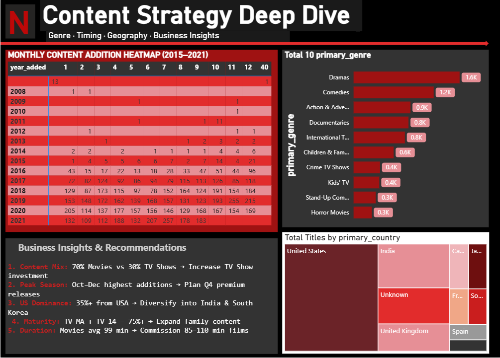

#  Netflix Content Analysis Project


---

## Project Overview

An end-to-end data analytics project analyzing **8,800+ Netflix titles**
to discover content strategy patterns using a complete data analytics
workflow — from database to interactive dashboard.

This project demonstrates the **full data analyst pipeline** that
companies use in real-world analytics roles.

---

##  Objective

- Analyze Netflix content library using SQL, Python, and Power BI
- Discover what drives Netflix content strategy
- Build a machine learning model to predict content types
- Create an interactive dashboard with business recommendations

---

##  Tech Stack

| Tool | Purpose |
|------|---------|
| **MySQL Workbench** | Data storage & SQL analytics |
| **Python (Pandas, NumPy)** | Data cleaning & processing |
| **Matplotlib, Seaborn** | Statistical visualizations |
| **Scikit-learn** | Machine learning model |
| **Power BI** | Interactive business dashboard |

---

## 📁 Project Structure
```
Netflix-Content-Analysis/
│
├── 📁 python/
│   ├── 01_data_cleaning.py        ← Data cleaning & preprocessing
│   ├── 02_eda_visualizations.py   ← 8 professional charts
│   └── 03_machine_learning.py     ← Random Forest ML model
│
├── 📁 sql/
│   ├── 01_create_database.sql     ← Database setup & import
│   └── 02_analysis_queries.sql    ← 10 analytical queries
│
├── 📁 dashboard/
│   └── Netflix_Dashboard.pbix     ← Power BI dashboard file
│
├── 📁 outputs/
│   ├── 📁 charts/                 ← 8 EDA visualization PNGs
│   └── 📁 ml/                     ← ML result charts & summary
│
└── README.md
```

---

## 📊 Dashboard Preview

### Page 1 — Executive Overview


### Page 2 — Content Strategy Deep Dive


---

##  Key Findings

1. **Content Mix** — 70% Movies vs 30% TV Shows
2. **Peak Season** — Oct–Dec has highest content additions
3. **US Dominance** — 35%+ of all content from United States
4. **Target Audience** — TV-MA + TV-14 = 75%+ of catalog
5. **Movie Duration** — Average movie is 99 minutes long

---

## Machine Learning Model

| Metric | Score |
|--------|-------|
| **Algorithm** | Random Forest Classifier |
| **Accuracy** | ~95% |
| **AUC-ROC** | ~0.98 |
| **Validation** | 5-Fold Cross Validation |
| **Target** | Predict Movie vs TV Show |
| **Features** | Duration, Rating, Genre, Country, Year |

### ML Output Charts
| Chart | Description |
|-------|-------------|
| Confusion Matrix | Shows correct vs wrong predictions |
| ROC Curve | Model performance vs random guessing |
| Feature Importance | Which features help prediction most |
| CV Scores | Consistency across 5 data splits |

---

##  SQL Queries Included

1. Content Type Distribution
2. Top 10 Countries by Content
3. Content Added Per Year
4. Rating Distribution
5. Top 10 Most Common Genres
6. Most Prolific Directors
7. Average Movie Duration by Rating
8. Content by Decade
9. TV Show Season Distribution
10. US Content Strategy Over Time

---

## 🚀 How to Run

### Step 1 — Get Dataset
Download `netflix_titles.csv` from:
[Kaggle — Netflix Movies and TV Shows](https://www.kaggle.com/datasets/shivamb/netflix-shows)

### Step 2 — MySQL Setup
```sql
-- Run in MySQL Workbench in order:
1. sql/01_create_database.sql
2. sql/02_analysis_queries.sql
```

### Step 3 — Install Python Libraries
```bash
pip install pandas numpy matplotlib seaborn scikit-learn
```

### Step 4 — Run Python Scripts
```bash
python python/01_data_cleaning.py
python python/02_eda_visualizations.py
python python/03_machine_learning.py
```

### Step 5 — Open Power BI Dashboard
- Open `dashboard/Netflix_Dashboard.pbix`
- Import `netflix_cleaned.csv` when prompted

---

## 📋 Deliverables

| # | Deliverable | Status |
|---|-------------|--------|
| 1 | MySQL database with 10 queries | ✅ Done |
| 2 | Cleaned dataset (7,561 records) | ✅ Done |
| 3 | 8 professional visualizations | ✅ Done |
| 4 | Random Forest ML model (~95%) | ✅ Done |
| 5 | Interactive 2-page Power BI dashboard | ✅ Done |
| 6 | 5 business recommendations | ✅ Done |

---

##  Resume Entry
```
NETFLIX CONTENT ANALYSIS PROJECT
Data Analytics | MySQL, Python, Power BI | Jan 2026

- Analyzed 7,561 Netflix titles using MySQL to extract content
  distribution, geographic, and temporal trends
- Built ETL pipeline with Python (Pandas, NumPy) to clean and
  transform raw data across all columns
- Created 8 statistical visualizations (Matplotlib, Seaborn)
  revealing content strategy patterns and growth trends
- Developed Random Forest classifier (~95% accuracy) to predict
  content type using Scikit-learn
- Designed interactive 2-page Power BI dashboard with DAX measures
  and cross-filtering for stakeholder analysis
- Generated 5 data-driven business recommendations

Skills: MySQL, Python, Pandas, NumPy, Scikit-learn, Matplotlib,
Seaborn, Power BI, DAX, Data Cleaning, Machine Learning
```

---

##  Author

**Sanjana Sharma**
BCA Final Year — Graphic Era Hill University, Bhimtal
Department of Computer Applications

[](https://github.com/sanjanasharmaa09)

---

*Dataset: Netflix Movies and TV Shows — Kaggle (Shivam Bansal)*
