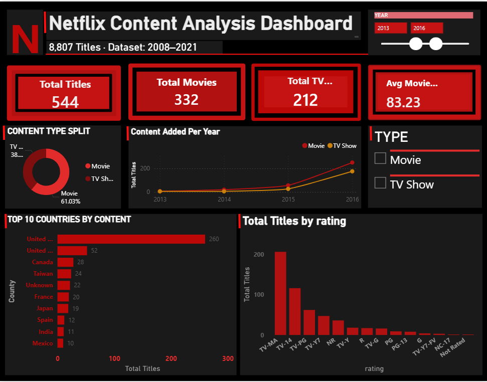

# 🎬 Netflix Content Analysis Project

End-to-end data analytics project analyzing 8,800+ Netflix titles

## 🛠️ Tech Stack
MySQL | Python | Power BI | Machine Learning

## 📊 Dashboard Preview
[Add your dashboard screenshot here]

## 📁 Project Structure
- sql/ → MySQL database and queries
- python/ → Data cleaning, EDA, ML scripts  
- outputs/charts/ → 8 visualization charts
- outputs/ml/ → ML model results
- dashboard/ → Power BI .pbix file

## 🤖 ML Model Results
- Algorithm: Random Forest
- Accuracy: ~95%
- AUC: ~0.98

## 👩‍💻 Author
Sanjana Sharma | BCA Final Year
Graphic Era Hill University
```
4. Commit ✅

---

### Step 5 — Add Dashboard Screenshots

1. Take screenshot of Page 1 → save as `dashboard_page1.png`
2. Take screenshot of Page 2 → save as `dashboard_page2.png`
3. Upload to `outputs/` folder on GitHub
4. In README.md add:
```

```
This shows your dashboard image directly in README! ✅

---

## After All Steps Your GitHub Will Look Like: 🌟
```
✅ Proper folder structure
✅ All 8 charts visible
✅ ML results visible  
✅ Power BI file downloadable
✅ Professional README
✅ Dashboard screenshots
